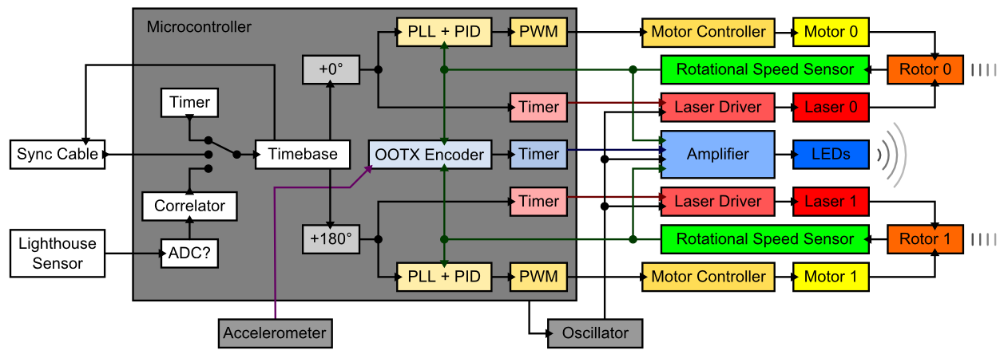

# Base Station

A Lighthouse Base Station is a light-emitting device that acts as a reference point for Lighthouse-compatible receivers ["Watchmen"?].

[TODO: more text]

## Block Diagram

## Modes

...

## Base Station Info Block

[TODO: Name is made up. Find real name...]

Tracked objects need to know some information about each base station they see. [TODO: more text]

Offset | Type    | Name             | Description
-------|---------|------------------|------------
0x00   | uint16  | fw_version       | Firmware version (bit 15-6), protocol version(?) (bit 5-0)
0x02   | uint32  | ID               | CRC32 of 128-bit MCU UID
0x06   | float16 | fcal.0.phase     | "phase" for rotor 0
0x08   | float16 | fcal.1.phase     | "phase" for rotor 1
0x0A   | float16 | fcal.0.tilt      | "tilt" for rotor 0
0x0C   | float16 | fcal.1.tilt      | "tilt" for rotor 1
0x0E   | uint8   | sys.unlock_count | Lowest 8 bits of the rotor desynchronization counter
0x0F   | uint8   | hw_version       | Hardware version
0x10   | float16 | fcal.0.curve     | "curve" for rotor 0
0x12   | float16 | fcal.1.curve     | "curve" for rotor 1
0x14   | int8    | accel.dir_x      | "orientation vector"
0x15   | int8    | accel.dir_y      | "orientation vector"
0x16   | int8    | accel.dir_z      | "orientation vector"
0x17   | float16 | fcal.0.gibphase  | "gibbous phase" for rotor 0 (normalized angle)
0x19   | float16 | fcal.1.gibphase  | "gibbous phase" for rotor 1 (normalized angle)
0x1B   | float16 | fcal.0.gibmag    | "gibbous magnitude" for rotor 0
0x1D   | float16 | fcal.1.gibmag    | "gibbous magnitude" for rotor 1

[TODO: Probably outdated by now... Extract new OOTX frame payload.]  
[TODO: More details]