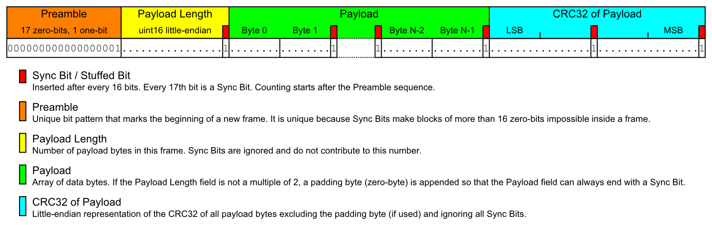

# Light Emissions

[TODO: Overview with a timing diagram]

## Sync Pulse

The synchronization pulse is a short flash of light that base stations emit periodically.
It is used for time synchronization and data transmission between base station and receivers.

The rising edge signals the start of a new rotation period for one of the two rotors.
The length of the sync pulse is used for identifying which rotor just hit its 0° mark, for determining if this rotor will activate its laser in this cycle, and for broadcasting information about the base station that sent this sync pulse.

Since sync pulses are used to synchronize time, they have to hit all reachable sensors of all tracked objects simultaneously. Therefore they use a wide angle light source like LEDs that can flood the entire tracked volume with light. The parts of a base station that generate this light pulse are called OOTX (Omnidirectional Optical Transmitter).

### Pulse Length

The following sync pulse lengths are defined:

Name | skip | data | axis  | length (ticks) | length (µs)
-----|------|------|-------|----------------|------------
j0   | 0    | 0    | 0     | 3000           | 62.5
k0   | 0    | 0    | 1     | 3500           | 72.9
j1   | 0    | 1    | 0     | 4000           | 83.3
k1   | 0    | 1    | 1     | 4500           | 93.8
j2   | 1    | 0    | 0     | 5000           | 104
k2   | 1    | 0    | 1     | 5500           | 115
j3   | 1    | 1    | 0     | 6000           | 125
k3   | 1    | 1    | 1     | 6500           | 135

Each length represents a combination of 3 bit states:  
The **axis** bit determines the rotation axis for the laser sweep that follows the sync pulse.  
The **skip** bit determines if the rotor will skip this period and leave its laser off.  
The **data** bits of consecutive sync pulses of a base station concatenated together yield a data structure called OOTX Frame.

In reality the listed sync pulse lengths should be considered maximum values. The real length should be in a 500 tick window ending at the listed length.  
E.g. sync pulse *j0* can be 2501-3000 ticks long depending on the position and orientation relative to the base station.

Given a measured pulse length the best match can be found using:  
`[skip,data,axis] = (length - 2501) / 500`

Given the 3 bits the pulse length can be calculated:  
`length = 3000 + axis*500 + data*1000 + skip*2000`

### OOTX Frame

The OOTX Frame is a data structure that base stations broadcast to all tracked objects in their field of view. Each sync pulse contains one bit of data of the frame.

An OOTX frame transmission can be aborted and restarted by the sender at any time. The receiver always has to look out for the preamble sequence that marks the beginning of a new frame. Partially received frames should be ignored.

The only known OOTX frame payload is the [Base Station Info Block](Base Station.md#base-station-info-block).

## Lasers

[TODO]
